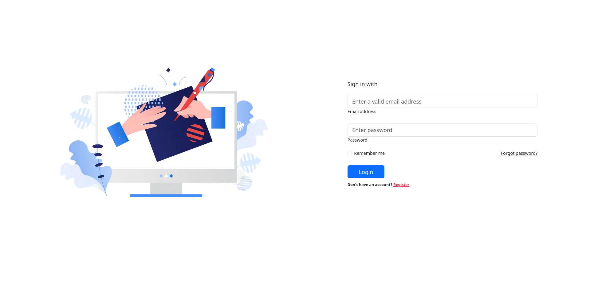
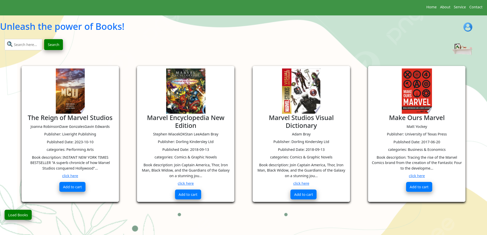
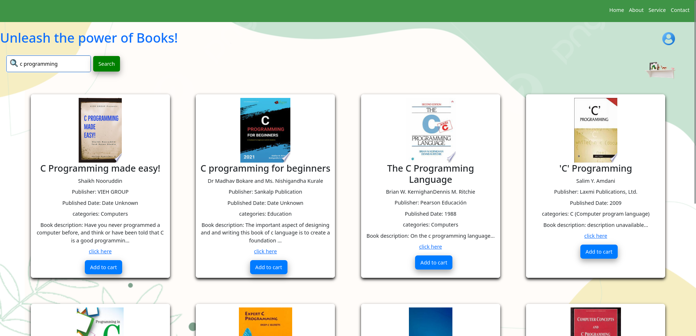
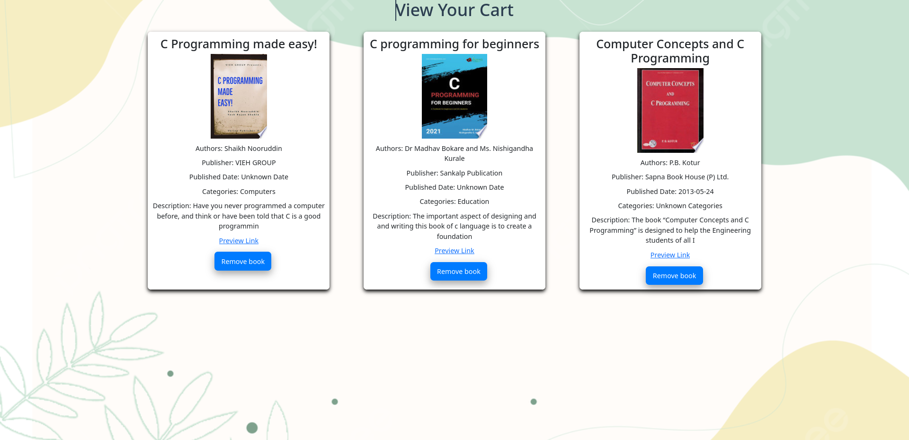

# Book Library

A web-based application for managing and exploring books using the Google Books API.

## Features
- Search for books by title, author, or keyword
- View book details including description, author, and publication date
- Save favorite books to a personal collection

## Technologies Used
- **Frontend:** React.js
- **API:** Google Books API
- **Styling:** CSS

## Screen Shorts:
### Login page

### Home page

### Search

### Cart page
